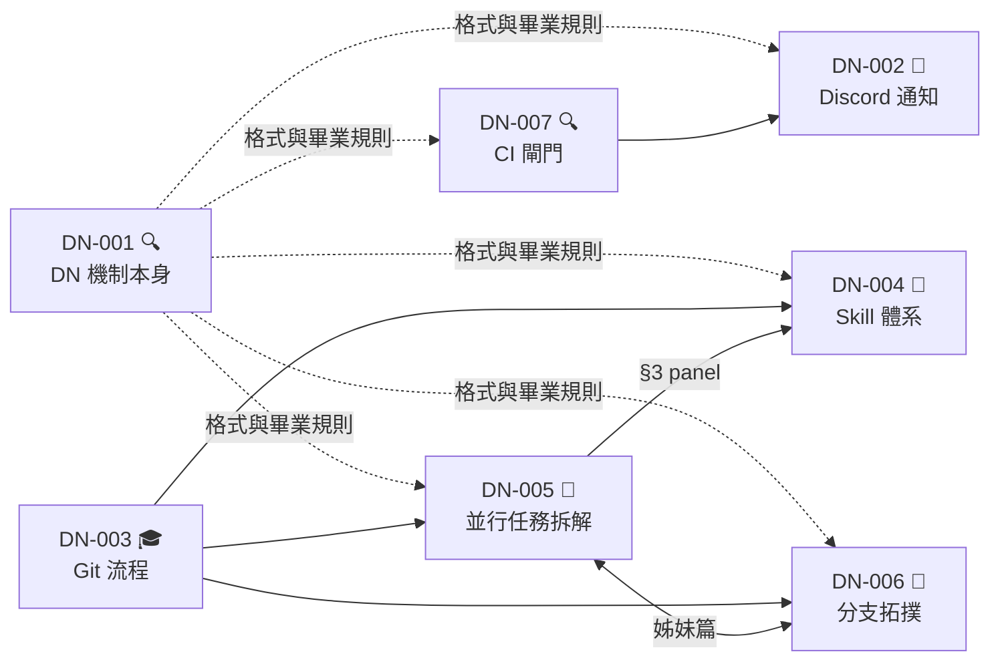

# [DN-001] Design Note 機制本身的設計

> 🎓 已畢業（2026-08-17）→ PEV-DEV-AGENT-004 ～ 009。本檔凍結，不再更新。

**🚥 狀態 (Status):** 🎓 Graduated
**📅 建立 (Created):** 2026-08-16
**🔗 依賴 (Depends on):** —
**📌 來源 (Origin):** 使用者指令（2026-08-16，針對 Icebox 的 design_note 重新規劃）
**🎓 畢業去向 (Landing):** D（改流程／基礎建設）→ PEV-DEV-AGENT-004 ～ 009，見 §6

> ⚠️ **DN 不得寫實作步驟。** 開始寫「第一步做什麼、第二步做什麼」＝這份 DN 該畢業了。
> 本檔用自己定義的格式記錄自己的設計，是這套機制的第一次實跑。

## 1. 問題陳述

`docs/features/process_evolution/design_note.md` 一份檔案裝了九個彼此無關的待決問題
（266 行 / 13.8 KB），BACKLOG 的 Icebox 則只有一行行的名詞。兩邊都不可用：
前者太大沒人讀，後者太薄想不起來當初在講什麼。

更根本的是**缺一個中間態**。現有流程只有兩格：

| | 含義 |
|---|---|
| **Icebox 一行** | 有這件事，還沒決定要不要做 |
| **工單** | 已決定要做，規格已定，可執行 |

中間那格——**「值得做，但還不知道要做成什麼樣」**——沒有地方放。

## 2. 既有慣例已經留好位置，只是沒命名

`docs/standards/documentation_conventions.md` §3 明文：

> ADR 只在決策已定案／已生效時撰寫，不對規劃中／尚待驗證的方案預先寫 ADR
> （即不使用 `Proposed` 狀態）。**規劃階段的假說與待驗證設計，依 §2 規則寫進補充檔**。

所以「已經想過、還沒定案」本來就該有家。但 §2.2 把補充檔命名為
`lld_0XX_{主題}.md` / `hld_0XX_{主題}.md`——**這預設母文件 `lld.md`/`hld.md` 已存在**，
而 DN 之所以存在，正是因為那個模組還不存在。

**DN 不是新發明的平行系統，是把 §3 已承認、§2.2 接不住的那段補起來。**

## 3. 已定調的設計

### 3.1 落點與命名

```
docs/design_notes/
├── DN-001_design_note_mechanism.md
└── DN-002_discord_notification_layer.md
```

- **全域扁平**，不放模組底下。理由：DN 存在的前提就是「還不知道屬於哪個模組」；
  而本 repo Icebox 那 12 項幾乎沒有一項屬於任何功能模組。
- **全域流水號**，理由直接沿用 `documentation_conventions.md` §3 對 ADR 的立規背景
  （來源專案曾因多套並行編號造成五組衝突）。取號：
  ```bash
  grep -rhoE "DN-[0-9]+" docs --include=*.md | sort -t- -k2 -n | tail -1
  ```
- **要圖用 Mermaid 內嵌**，不開附件目錄——每份 DN 永遠是單一檔案，
  不必為「有附件的 DN」發明第二種形狀。

### 3.2 進場規則：AC 難產時才開 DN

DN 的身分不是「Icebox 項目的展開」，而是**開單前置關卡**。
Icebox 只是來源之一，使用者直接下指令同樣可以觸發。

| 情境 | 動作 |
|---|---|
| scrum-master **當場寫得出可驗收的 AC** | 直接開工單，**不要開 DN** |
| 寫不出來——方案沒定、邊界不清、影響範圍未知 | **先開 DN** |

一句話：**DN 是 AC 難產時的緩衝區。** 進場與畢業共用同一個測試（見 §3.4）。

### 3.3 狀態

```
🌱 Seed ──→ 🔍 Exploring ──→ 🎓 Graduated（已開工單）
                         └─→ 🚫 Dropped（決定不做）
```

| 狀態 | 含義 | 誰推進 |
|---|---|---|
| 🌱 Seed | 檔案剛建，只有問題陳述，沒人在推 | scrum-master |
| 🔍 Exploring | 正在比方案，「待決事項」清單成形中 | system-architect / tech-lead |
| 🎓 Graduated | 工單已開出，DN 凍結唯讀 | **使用者簽核** |
| 🚫 Dropped | 決定不做，理由必填，DN 凍結唯讀 | **使用者簽核** |

**刻意不重用工單的五狀態**：工單狀態回答「事情做完了沒」，DN 回答「問題想清楚了沒」。
共用詞彙會讓 `scan_backlog.py` 與 Agent 混淆，也會誘使人把 DN 當工單推進。

### 3.4 畢業條件（三條全中）

1. **「待決事項」每項都有答案**——或明確標記「延後至 DN-0YY」。延後也要有去處。
2. ⭐ **寫得出至少一張工單的驗收標準**。寫不出可驗收的 AC ＝ 設計沒收斂完，不准畢業。
3. **使用者本人簽核**——DN 畢業屬於「只有你能決定」那一類，不外包給 AI。

第 2 條是主力：它把「想清楚了沒」這種主觀感覺換成一個當場可驗證的動作，
也防止 `Exploring` 變成無限期停車場（Icebox 現在的病）。

### 3.5 畢業去向（必填，畢業時才算數）

**結論落不到第 1 層文件，對 Agent 而言等於不存在。**
`team_protocol.md` §1.11 定義第 1 層＝`docs/features/{module}/{brd,prd,hld,lld,api_spec,test_plan}.md`
與 `docs/standards/`，是**唯一的開發準則**；`docs/design_notes/` 不在表上。

| 去向 | 落在哪個第 1 層文件 | 附帶動作 |
|---|---|---|
| **A. 新開模組** | 新 `docs/features/{模組}/` 底下文件 | 登記前綴、展開 `_TEMPLATE/`、DOCS_MAP 補列 |
| **B. 掛現有模組** | 該模組 `prd`／`hld`／`lld` 對應章節 | 篇幅大時依 §2.2 拉補充檔 |
| **C. 改跨模組規範** | `docs/standards/*.md` | 通常同時要一則 ADR |
| **D. 改流程／基礎建設** | `docs/standards/` | 工單掛在基礎建設模組（見 §3.7） |
| **E. 純決策，無文件變更** | 只有 ADR | Icebox 移除 |
| **F. 拆成多份 DN** | 無 | 舊 DN 標 `Split`，子 DN 繼承脈絡 |
| **G. 放棄** | 無 | 標 `Dropped`，**理由必填** |

**A 還是 B**——四條全中才開新模組：

1. 能一句話講清職責，且不需要說「就是 X 的一部分」
2. 需要自己的 PRD，不是現有 PRD 的一節
3. 預期 **≥ 3 張工單**（一兩張不值得付目錄＋前綴＋DOCS_MAP 的開辦成本）
4. 主要改動的檔案跟現有模組不重疊

紅旗（任一中就別開新的）：描述時反覆引用現有模組／主要改動落在現有模組的檔案／只有 1–2 張工單的量。
**由 AI 提建議＋理由＋反方，使用者拍板。**

### 3.6 DN 全文不折併，但結論必須落地

這一條刻意偏離 `documentation_conventions.md` §2.1「工單 Done 後折併回主文件」，理由要寫進規範：

- **不折併全文**——探索過程、被否決的方案、錯掉的假設不該進 `lld.md`/`hld.md`；
  §2.1 自己就說那兩份「應只承載目前已生效的架構事實」。
- **但結論中屬於架構事實的部分必須寫進第 1 層**，這是畢業的必要條件，不是選項。
- **不刪、不搬、凍結唯讀**。DN 記的是被否決的選項與否決理由，刪掉就永遠回答不了
  「當初為什麼不用 X」。搬目錄會弄斷既有連結。

畢業後頂端加一行：`> 🎓 已畢業（YYYY-MM-DD）→ {工單號}。本檔凍結，不再更新。`

### 3.7 模組正名：加「類型」欄位，目錄名不改

`team_protocol.md` §3.1 的模組前綴對照表加一欄：

| 前綴 | 模組名稱 | **類型** | 對應目錄 |
|------|---------|---------|---------|
| `XXX` | 範例功能模組 | 功能 | `docs/features/example_module/` |
| `INF` | 開發流程與基礎建設 | **基礎建設** | `docs/features/infrastructure/` |

配一段定義：「模組」是**工單與文件的歸屬單位**，不等於「使用者可見的功能」。
目錄一律留在 `docs/features/` 底下——這名稱是歷史沿革，**刻意不改**：
改名會弄斷所有既有連結、`.kit-manifest` 基準線與 `scan_backlog.py` 的硬編路徑。

**這一欄必須改變行為才值得加**：

| | 功能模組 | 基礎建設模組 |
|---|---|---|
| 必備文件 | `prd.md` 起跳，完整展開 `_TEMPLATE/` | ⭐ **不需要 PRD**——沒有使用者故事可寫 |
| 第 1 層權威在哪 | 該模組的 `prd`／`hld`／`lld` | ⭐ **`docs/standards/`**——規範本身就是它的規格 |
| 驗收依據 | 使用者價值 | 測試通過 ＋ 規範文件已更新 |

第一列是真正的價值：**不要逼 Agent 為基礎建設模組硬生一份填滿「作為一個使用者，我希望…」的空洞 PRD。**
第二列讓去向 D 自動閉合——§1.11 本來就把 `docs/standards/` 列為第 1 層，不需新增權威規則。

**支持事實**：本 repo 三個模組（`process_evolution`、`kit_sync`、`worktree_guard`）
**全部是基礎建設，一個功能模組都沒有**。整個專案用不到「功能模組」這個概念，卻被迫住在 `docs/features/` 底下。

### 3.8 DN 在權威階序中的位置

必須明文寫進 §1.11，否則 Agent 會讀到一份 `Exploring` 的 DN 然後照著實作：

| DN 狀態 | 效力 |
|---|---|
| 🌱 Seed／🔍 Exploring | **不在權威階序內**，連「待辦意圖」都不是（開放工單至少已定案要做） |
| 🎓 Graduated／🚫 Dropped | **歷史紀錄，不得作為規格依據**（比照第 4 層已結案工單，理由相同：舊快照不能當準則） |

### 3.9 其他已定規則

- **依賴欄位**：DN 之間會互相牽制（Discord 推播依賴 CI 的存在）。缺這欄會產出互不相容的方案。
- **推翻已畢業的 DN**：不改舊 DN，開新 DN，舊的標 `Superseded by DN-0YY`。沿用 ADR 既有慣例。
- **不得寫實作步驟**：開始寫步驟＝該畢業了。這是「DN 退化成第二套工單系統」的防線。
- **軟上限 250 行**：超過不是違規，是觸發一次檢查——
  (1) 裝了不只一個待決問題？→ 拆（去向 F）。
  (2) 已經夠寫 AC 了？→ 畢業。兩題都否就註明「已檢查」繼續長。
  行數本身判不了好壞：266 行的舊 `design_note.md` 該拆是因為裝了九個問題，不是因為長。
- **索引用腳本生成，不手動維護**：生成的索引不可能有孤兒、不需要強制登記儀式，
  且避開 `DOCS_MAP.md` 那個坑重演——kit 出貨一份需要專案自填的索引檔，
  結果必然是每次升級都跳 `.new`。

## 4. 待決事項

- [x] 範本最終欄位（§4.1）
- [x] 索引生成腳本的形狀（§4.2）⭐
- [x] `DOCS_MAP.md` 的「功能模組」表頭要不要改字（§4.3）⭐
- [x] 是否出貨到 `kit/`（§4.4）⭐
- [x] 基礎建設模組要不要有固定前綴慣例（§4.5）

五項都有答案，格式依 §3.5 末句：**AI 提建議＋理由＋反方，使用者拍板**。
標 ⭐ 的三項在畢業前需要裁定，其餘兩項無異議即照建議走。

### 4.1 範本最終欄位

實跑六份後的欄位使用率——這就是當初說「要實跑幾份才知道」的那份資料：

| 欄位 | 使用 | 觀察 |
|---|---|---|
| 🚥 狀態 | 6/6 | 有值且會變動 |
| 📅 建立 | 6/6 | 有值 |
| 🔗 依賴 | 6/6 | 有值（DN-001 填 `—`）；§7 已實際拿它算過一次順序 |
| 📌 來源 | 5/6 | ⚠️ **DN-003 漏填**——可選欄位就是會漏 |
| 🎓 畢業去向 | 6/6 | ⚠️ **五份是「待填」**，只有已畢業的 DN-003 有真值 |
| 🤝 姊妹篇 | 2/6 | 範本裡沒有，DN-005／006 自創 |

**建議**：

1. **刪掉 header 的「🎓 畢業去向」欄位。** 它在 Seed／Exploring 期間永遠是「待填」，
   而值產生的那一刻（畢業）§6 本來就要填，§3.6 還要求頂端加一行
   `> 🎓 已畢業（YYYY-MM-DD）→ {工單號}`。同一件事記三個地方，其中兩處長期是假值。
2. **「📌 來源」改必填。** 它決定誰有權裁定（使用者指令 vs 自發），
   畢業條件 3 要簽核時會用到。DN-003 漏填就是「可選 ＝ 會漏」的實證。
3. **「🤝 姊妹篇」正式入範本。** 不是因為 n=1 就擴充：雙向關係若塞進「依賴」欄位，
   索引腳本做拓撲排序時只會看到一個環（DN-005 → DN-006 → DN-005），
   分不出「A 要等 B」與「A、B 必須同時設計」。分欄是為了讓那支腳本判得出來。
4. **不加「最後更新」欄位。** 手填必腐爛；自動填會讓版控檔的內容不再是輸入的純函數（§5）。

**反方**：刪掉「畢業去向」會讓索引腳本少一個好抓的欄位。
但腳本要抓的是**已畢業**的去向，而 §3.6 那行頂端標記只在真畢業時存在，
沒有「待填」噪音，反而比 header 欄位乾淨。

### 4.2 ⭐ 索引生成腳本的形狀

**先看事實**：`BACKLOG.md` 的 🧊 冰箱現在有六列手抄的 DN，欄位是「項目／狀態／卡在哪」。
**那已經是一份手動維護的 DN 索引，正好違反 §3.9 自己立的規則。**

**建議：併進 `scan_backlog.py`，在 `--format backlog` 的輸出中新增一節
「🧪 設計筆記 (Design Notes)」，排在 🧊 冰箱之前。不另開索引檔、不加新的 `--format`。**

理由：

- **不必發明「要去哪裡看」。** DN 是開單前置關卡，讀者跟 BACKLOG 是同一批人、同一個時機；
  另開 `DESIGN_NOTES.md` 等於多一個沒人記得看的檔案。
- 冰箱那六列可以直接刪掉，手抄索引隨之消失，§3.9 自動閉合。
- 腳本已有 `--output`、`extract_existing_icebox()` 這些基礎設施，
  新增一節是加一個 formatter，不是多養一支腳本。
- **輸出必須是輸入的純函數**（§5）：只印狀態、標題、依賴與懸空依賴警告，不印任何天數。

順帶，§7 暴露的「依賴可以指向不存在的 DN」（DN-002 懸空了六份 DN 沒人發現）
就是這支腳本第一個該有的檢查：**列出所有指向不存在 DN 的依賴**。

**反方**：`scan_backlog.py` 已經 579 行，再塞一個 formatter 只會更肥；
獨立腳本責任單一，也不必讓「掃工單」的腳本被迫認識 DN 的格式。

> ✅ **裁定（2026-08-17）：照建議，併進 `scan_backlog.py`。** → PEV-DEV-AGENT-008

### 4.3 ⭐ `DOCS_MAP.md` 表頭要不要改字（順帶：要不要列為種子檔）

kit 出貨的表頭是 `## 功能模組 (features/)`，欄位「前綴｜模組｜文件｜工單」。
加了類型欄位後，「功能模組」這個標題會跟「基礎建設模組」直接打架。

**建議**：

1. 標題改為 **`## 模組 (features/)`**，表格加一欄「類型」。
   目錄名 `features/` 不動——§3.7 已定：改名會弄斷既有連結、`.kit-manifest` 基準線
   與 `scan_backlog.py` 的硬編路徑。
2. **順便把 `docs/DOCS_MAP.md` 列入 `install.sh` 的 `is_seed_file()`。**

第 2 點的理由：kit 出貨的 DOCS_MAP **本來就要求專案自填模組表**，
自填 ＋ 非種子檔 ＝ 每次升級必跳 `.new`。這不是使用者亂改，是規範叫他改的。
現行種子檔是 `CLAUDE.md`、`.gitignore`、`BACKLOG.md`，三份的共同特徵正是
「出貨時給一個起點、之後歸專案所有」，DOCS_MAP 完全符合。

**反方**：一旦列為種子檔，**kit 日後改 DOCS_MAP 的骨架（新增章節、改導航規則）
就再也推不到既有專案**，使用者永遠停在安裝當天的版本。
`BACKLOG.md` 能承受這個代價是因為它由腳本整份重生成，DOCS_MAP 沒有生成器，骨架真的會凍住。

折衷第三案：**維持非種子檔，把會變動的模組表抽成獨立檔**
（例如 `docs/features/README.md`——本 repo 已經自發長出這個檔，而且安裝從不碰它）。
骨架仍可升級，會變動的那張表歸專案所有。

> ✅ **裁定（2026-08-17）：第三案。** 不列為種子檔，模組表抽成獨立檔——
> DOCS_MAP 的骨架仍可隨 kit 升級，會變動的那張表歸專案所有，`.new` 衝突同時消失。
> → PEV-DEV-AGENT-009

### 4.4 ⭐ 是否出貨到 `kit/`

**建議：出貨。** `kit/docs/design_notes/` 放一份 `_TEMPLATE.md` ＋ 一份 `README.md` 說明機制，
**不出貨本 repo 的六份實例**（它們是本 repo 的歷史，對別的專案是噪音）。

理由：kit 的 scrum-master 被教「AC 寫不出來時先開 DN」，
但裝了 kit 的專案沒有 `docs/design_notes/`、沒有範本、沒有狀態機——
規範指向一個不存在的東西，跟「§6.1 要求 CI 擋合併、kit 卻零出貨 CI」是同一種病。
而且這套機制已經在本 repo 實跑六份、畢業一份（DN-003 → `git_workflow.md`），不是紙上設計。

**反方**：DN 是「專案在演化自己的流程」時才高頻使用的機制。
一般專案裝了 kit 之後可能一份 DN 都不會開，只多出一個空目錄與一份沒人讀的範本。
更根本的是 §3.4 條件 3 要求「使用者本人簽核」——這預設了使用者願意參與流程設計，
不是每個專案的使用者都想扮這個角色。
> ✅ **裁定（2026-08-17）：完整出貨**——目錄＋範本＋規範三者都給。
> → PEV-DEV-AGENT-004（規範）、006（scrum-master）、007（目錄與範本）

### 4.5 基礎建設模組的固定前綴

**建議：kit 在 `team_protocol.md` §3.1 的範例表列一列 `INF`／基礎建設，
標明「建議值，可自訂」，不做強制。**

理由：前綴唯一的硬性約束是「全專案唯一」（`scan_backlog.py` 靠它辨識工單歸屬）。
給一個建議值可以省掉每個專案自己想；不強制則是因為**本 repo 自己就沒用 `INF`**——
三個模組全是基礎建設，卻叫 `PEV`／`KIT`／`WTG`，而且這樣是對的：
它們是三個不同的基礎建設主題，硬塞進同一個 `INF` 反而失去解析度。

**反方**：給了建議值卻不強制，等於兩邊落空——想要一致性的人得不到保證，
而 `INF` 一旦出現在範例表，多數專案會照抄，實質上就變成強制。
若真要它有意義，應該連「什麼時候該用 `INF`、什麼時候該自己開一個」的判準
一起寫（可直接沿用 §3.5 A/B 那四條）。

## 5. 順帶產出、但不屬於本 DN 的結論

**「納入版控的生成檔，內容必須是輸入的純函數」**——不得含時間相依值。
起因是「停滯天數該不該印進 BACKLOG」：`BACKLOG.md` 由 `scan_backlog.py` 生成，
輸入是工單 `.md`；一旦嵌入「停滯 N 天」，輸入沒變輸出卻天天變，
**同一份 repo 在不同日期跑會產生不同檔案**，並連帶弄壞「重跑看有沒有 diff ＝ 判斷 BACKLOG 是否過期」這個現行檢查。

這條**當場寫得出 AC，依 §3.2 不需要 DN**，直接開工單即可（已列入 Icebox）。
停滯偵測本身移交 [DN-002](DN-002_discord_notification_layer.md)。

## 6. 畢業去向（畢業時填）

- **類型：D（改流程／基礎建設）**——依 §3.7，工單掛基礎建設模組，
  第 1 層權威在 `docs/standards/`，**不需要 PRD**。
- **落點與預計工單**（實際張數以 §4.2／4.3／4.4 的裁定為準）：

| 工單 | 落點 | 內容 | 出自 |
|---|---|---|---|
| **PEV-DEV-AGENT-004** | `kit/docs/standards/documentation_conventions.md` | 新增「Design Note 機制」一節：進場規則（§3.2）、狀態機（§3.3）、畢業條件（§3.4）、去向表（§3.5）、不折併（§3.6） | 4.4 |
| **PEV-DEV-AGENT-005** | `kit/.agent/resources/team_protocol.md` §1.11／§3.1 | §1.11 加 DN 的權威效力（§3.8）；§3.1 前綴表加「類型」欄與基礎建設模組的文件差異（§3.7），列 `INF` 為建議值 | 4.5 |
| **PEV-DEV-AGENT-006** | `kit/.agent/skills/scrum-master/SKILL.md` | 開單前置關卡：AC 當場寫得出 → 開工單；寫不出 → 開 DN | 4.4 |
| **PEV-DEV-AGENT-007** | `kit/docs/design_notes/`（新目錄） | `_TEMPLATE.md` ＋ `README.md`，header 欄位依 4.1（刪畢業去向、來源必填、加姊妹篇） | 4.1、4.4 |
| **PEV-DEV-AGENT-008** | `kit/.agent/scripts/scan_backlog.py` | 新增「🧪 設計筆記」一節取代冰箱裡的手抄索引 ＋ 懸空依賴檢查 | 4.2 |
| **PEV-DEV-AGENT-009** | `kit/docs/DOCS_MAP.md`、`kit/docs/features/README.md`（新） | 模組表抽成獨立檔，DOCS_MAP 只留指路；表頭「功能模組」→「模組」並加類型欄 | 4.3 |

> ⚠️ T2 動到 `team_protocol.md` 的章節結構時，必須同步指路檔
> `kit/docs/standards/team_protocol.md` 的章節索引，否則
> `test_指路檔章節索引與正版同步` 會紅。

- **AC 可寫性驗證（§3.4 條件 2）**——以 T4 為例，當場寫得出：
  「`kit/docs/design_notes/_TEMPLATE.md` 存在且含 4.1 定案的 header 欄位」、
  「`./install.sh` 裝到空目錄後 `docs/design_notes/_TEMPLATE.md` 存在」、
  「`kit/docs/DOCS_MAP.md` 有 `design_notes/` 一列」、「`uv run pytest` 全綠」。
  **條件 2 通過。**
- **簽核（§3.4 條件 3）**：✅ 使用者於 2026-08-17 簽核畢業。
  §4.1 與 §4.5 未另行裁定，依「無異議即照建議走」定案。
- **§3.9 軟上限自查**：本檔 384 行，遠超 250 行的軟上限。依該規則自查兩題——
  (1) 裝了不只一個待決問題？**否**，五項全部服務於「DN 機制本身怎麼設計」這一個問題。
  (2) 已經夠寫 AC 了？**是**，見上一條。兩題的組合指向畢業，不是拆（去向 F）。

## 7. DN 之間的執行順序（§3.9「依賴欄位」的第一次實跑）

§3.9 立「依賴欄位」的理由是「DN 之間會互相牽制，缺這欄會產出互不相容的方案」。
下面是拿六份 DN 的 `🔗 依賴` 欄位實際算一次順序——**這一節是那條規則的證據，
不是新的設計**。同時它直接支撐 §4 待決 2：索引生成腳本要不要順便算出這個順序。

### 7.1 依賴圖



### 7.2 順序與理由

| 順位 | DN | 為什麼是這個位置 |
|---|---|---|
| 1️⃣ | **DN-001** | **元層。** 其他每份 DN 畢業都要用它的 §3.4 畢業條件與 §3.5 去向表；§3.7 的「基礎建設模組」類型**決定後續所有 DN 的工單掛在哪個模組**。不先定它，後面每份 DN 畢業都要回頭改格式 |
| 2️⃣ | **DN-007**（2026-08-17 開出，🔍 Exploring） | 舊 `design_note.md` §5 就把 CI 閘門排第 1。DN-002 明文卡在它身上；且 `git_workflow.md` §6.1／§8.2 兩處要求「CI 紅燈硬擋合併」，而 `kit/.github/` **不存在**——規範要求了一個 kit 不提供的東西 |
| 3️⃣ | **DN-006 ＋ DN-005** | **必須綁在一起。** 兩份互為姊妹篇、互相引用，且 DN-006 §2.1 會推翻 DN-003 §3.3 的 squash-only。分開推正是 §3.9 要防的「產出互不相容的方案」。最重的一組（15 項待決） |
| 4️⃣ | **DN-004** | 依賴 DN-005 §3 的 panel 裁定。它要修的 7 份「從未複檢」skill 會被 1️⃣～3️⃣ 的產出再改一次——**先做等於白做** |
| 5️⃣ | **DN-002** | 依賴 2️⃣。純加值，不擋任何人 |

### 7.3 這次實跑暴露的兩件事

1. **`🔗 依賴` 欄位不足以表達「必須同時設計」。** DN-005 與 DN-006 用的是
   自創的 `🤝 姊妹篇` 欄位，不在 §3.1 的範本裡。要嘛把它納入範本，
   要嘛承認依賴欄位只表達單向先後——這是 §4 待決 1（範本最終欄位）的實據。
2. **依賴可以指向還不存在的 DN。** DN-002 寫「CI 閘門（尚未開 DN，見 Icebox）」，
   懸空了整整六份 DN 的時間都沒人發現。索引腳本若能標出**懸空依賴**，
   這種缺口就會自己浮出來，不必靠人記得——這是 §4 待決 2 的具體需求之一。
